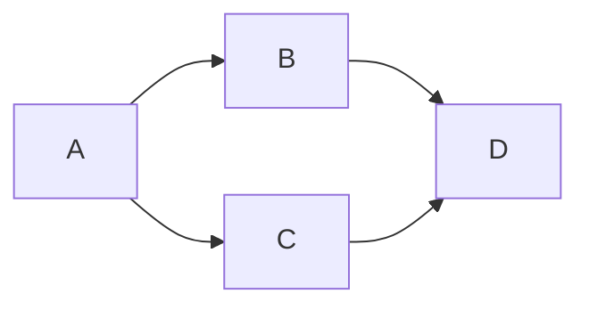

# E-Commerce API 設計書

## 1. 概要

このAPIは、オンライン販売プラットフォームの商品検索、注文管理、ユーザー認証を提供するRESTful APIです。

**ベースURL**: `https://api.ecommerce.example.com/v1`

**バージョン**: 1.0.0

---

## 2. 認証

すべてのエンドポイント（公開エンドポイント除く）にはBearerトークンが必須です。

```
Authorization: Bearer {access_token}
```

### トークン取得エンドポイント

**POST** `/auth/login`

```json
{
  "email": "user@example.com",
  "password": "securePassword123"
}
```

**レスポンス**:
```json
{
  "access_token": "eyJhbGciOiJIUzI1NiIs...",
  "token_type": "Bearer",
  "expires_in": 3600
}
```

---

## 3. エンドポイント一覧

### 3.1 商品一覧取得（公開）

**GET** `/products`

**クエリパラメータ**:
- `page` (integer, optional): ページ番号 (デフォルト: 1)
- `limit` (integer, optional): 1ページあたりの件数 (デフォルト: 20)
- `category` (string, optional): カテゴリーID
- `sort` (string, optional): ソート順序 (price_asc, price_desc, newest)

**レスポンス例** (200 OK):
```json
{
  "total": 150,
  "page": 1,
  "limit": 20,
  "items": [
    {
      "id": "prod_12345",
      "name": "ワイヤレスヘッドフォン",
      "price": 12999,
      "currency": "JPY",
      "category": "electronics",
      "stock": 45,
      "rating": 4.5,
      "image_url": "https://cdn.example.com/prod_12345.jpg"
    }
  ]
}
```

---

### 3.2 商品詳細取得（公開）

**GET** `/products/{product_id}`

**パスパラメータ**:
- `product_id` (string): 商品ID

**レスポンス例** (200 OK):
```json
{
  "id": "prod_12345",
  "name": "ワイヤレスヘッドフォン",
  "description": "高音質で快適な装着感...",
  "price": 12999,
  "currency": "JPY",
  "category": "electronics",
  "stock": 45,
  "rating": 4.5,
  "reviews_count": 128,
  "specifications": {
    "color": ["ブラック", "シルバー"],
    "battery_life": "30時間"
  }
}
```

---

### 3.3 注文作成

**POST** `/orders`

**リクエスト**:
```json
{
  "items": [
    {
      "product_id": "prod_12345",
      "quantity": 2
    }
  ],
  "shipping_address": {
    "street": "1-2-3 Shibuya",
    "city": "Tokyo",
    "postal_code": "150-0001",
    "country": "Japan"
  },
  "payment_method": "credit_card"
}
```

**レスポンス例** (201 Created):
```json
{
  "order_id": "ord_98765",
  "user_id": "usr_54321",
  "status": "pending",
  "total_amount": 25998,
  "currency": "JPY",
  "created_at": "2026-05-13T10:30:00Z",
  "estimated_delivery": "2026-05-20T23:59:59Z"
}
```

---

### 3.4 注文一覧取得

**GET** `/orders`

**レスポンス例** (200 OK):
```json
{
  "orders": [
    {
      "order_id": "ord_98765",
      "status": "shipped",
      "total_amount": 25998,
      "created_at": "2026-05-13T10:30:00Z"
    }
  ]
}
```

---

## 4. エラーレスポンス

### 共通エラーフォーマット

```json
{
  "error": {
    "code": "VALIDATION_ERROR",
    "message": "入力値が無効です",
    "details": [
      {
        "field": "email",
        "message": "有効なメールアドレスではありません"
      }
    ]
  }
}
```

### ステータスコード

| コード | 説明 |
|--------|------|
| 200 | 成功 |
| 201 | リソース作成成功 |
| 400 | リクエスト不正 |
| 401 | 認証失敗 |
| 403 | 権限不足 |
| 404 | リソース未検出 |
| 500 | サーバーエラー |

---

## 5. レート制限

- 認証済みユーザー: 1000リクエスト/時間
- 公開エンドポイント: 100リクエスト/時間

**レート制限ヘッダ**:
```
X-RateLimit-Limit: 1000
X-RateLimit-Remaining: 995
X-RateLimit-Reset: 1620967200
```

---

## 6. タイムゾーン

すべてのタイムスタンプはISO 8601形式 (UTC) で返却されます。

## 7. mermaidjs

